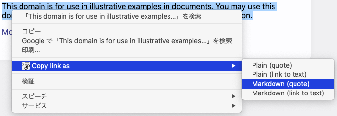
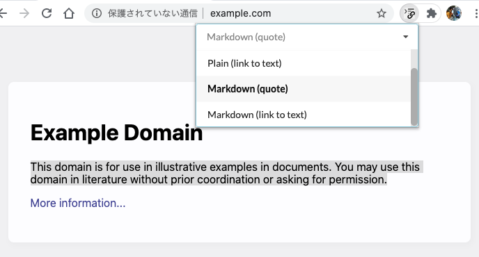

#  Copy Quote Link

A Chrome extension to share page content and the link with any formats

- 🔗 Copy links that contain page title and text content from context menu
- 🔦 Supports for creating a link which can highlight selected text ([Scroll To Text Fragment](https://wicg.github.io/scroll-to-text-fragment/))
- 📝 You can make your own templates to copy

## Usage

### ‣ Copy link via Context Menu

### ‣ Copy link via Shortcut Key

Default shortcut key is follows. 

- **Windows**: `Ctrl`+`Shift`+`X`
- **Mac**: `Command`+`Shift`+`X`
- **Linux**: `Ctrl`+`Shift`+`X`

You can change the setting via `chrome://extensions/shortcuts`

## Custom Templates

To custom the context menu, you can create templates from the extension option page.

You can find some examples on the following page.

[📝 Custom Template Examples](docs/template_examples.md)

## Dev Scripts

- `yarn start` - build dev-mode extension with auto-reloading
- `yarn package` - builds production extension package 

## Licence

Copyright (c) 2020 Kazuki Negoro

Copy Quote Link is released under the [MIT License](LICENSE)
